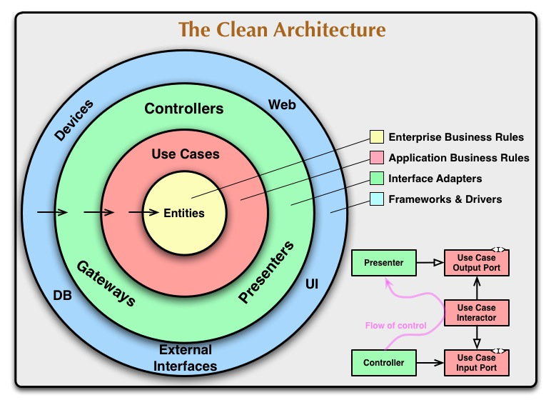

# Clean Architecture with PHP

This is a simple example of how to implement the Clean Architecture with PHP.
This project is based on the [ALURA](https://www.alura.com.br/) course [Clean Architecture with PHP](https://cursos.alura.com.br/course/php-introducao-clean-achitecture).